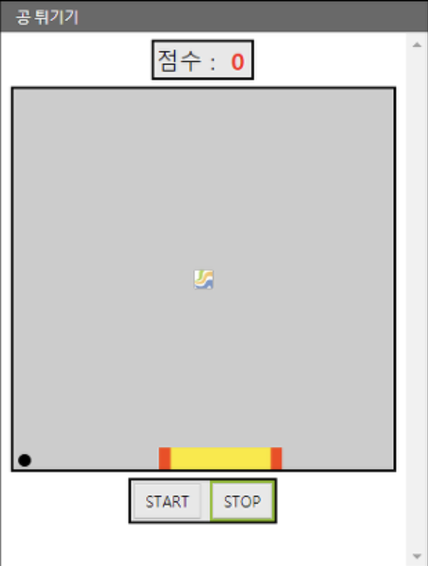
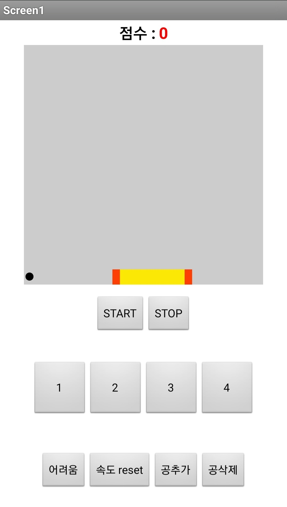
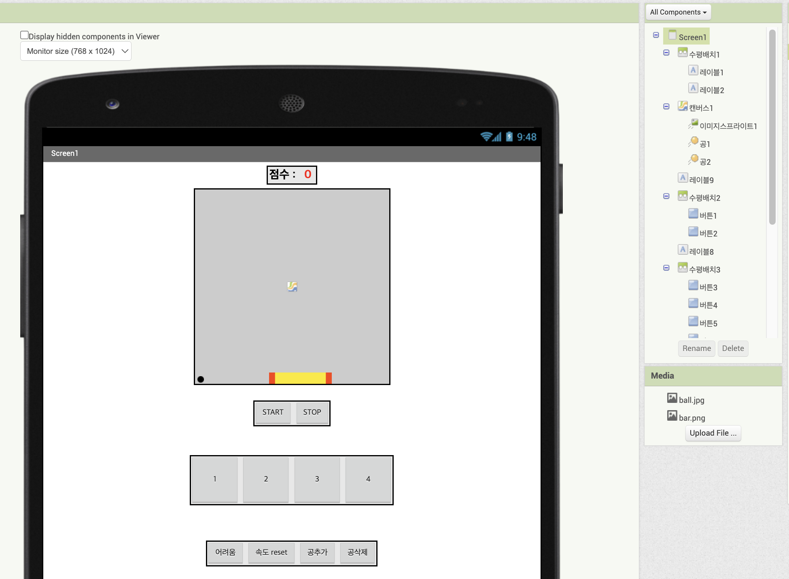
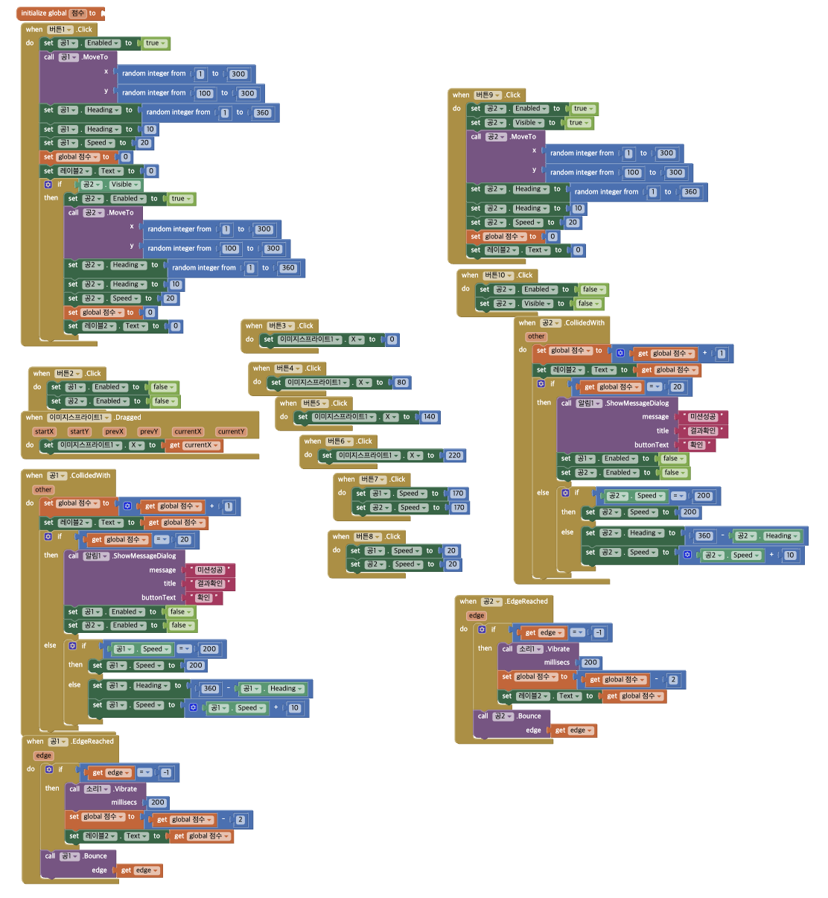
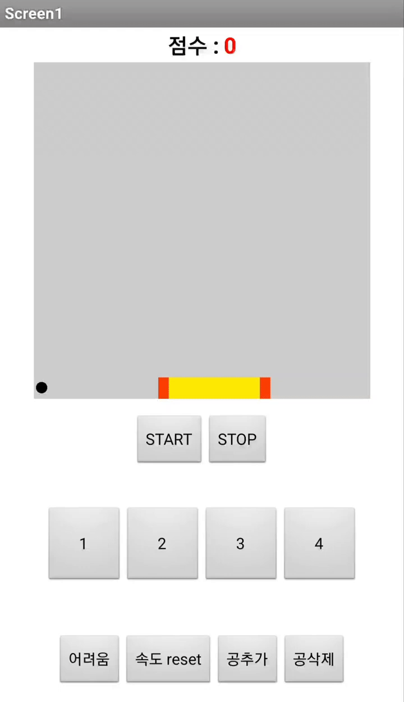
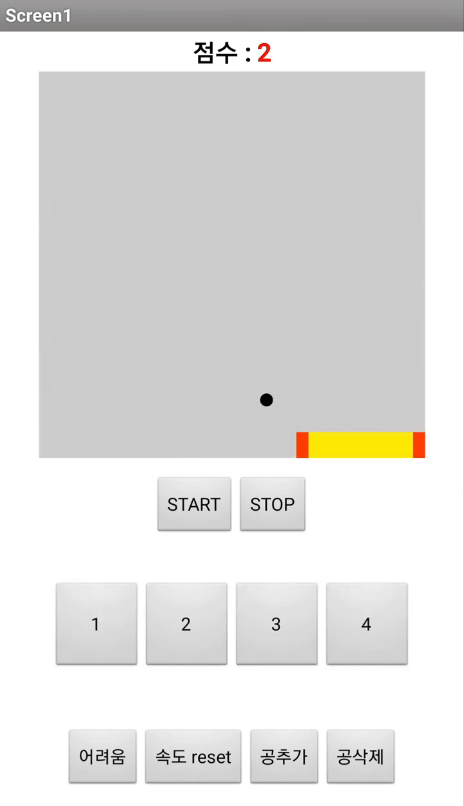
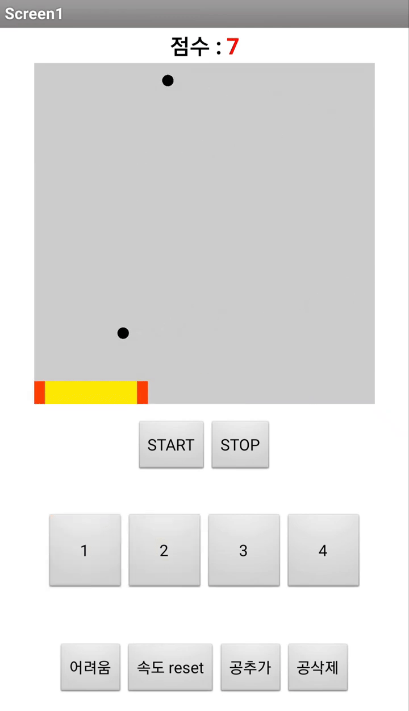
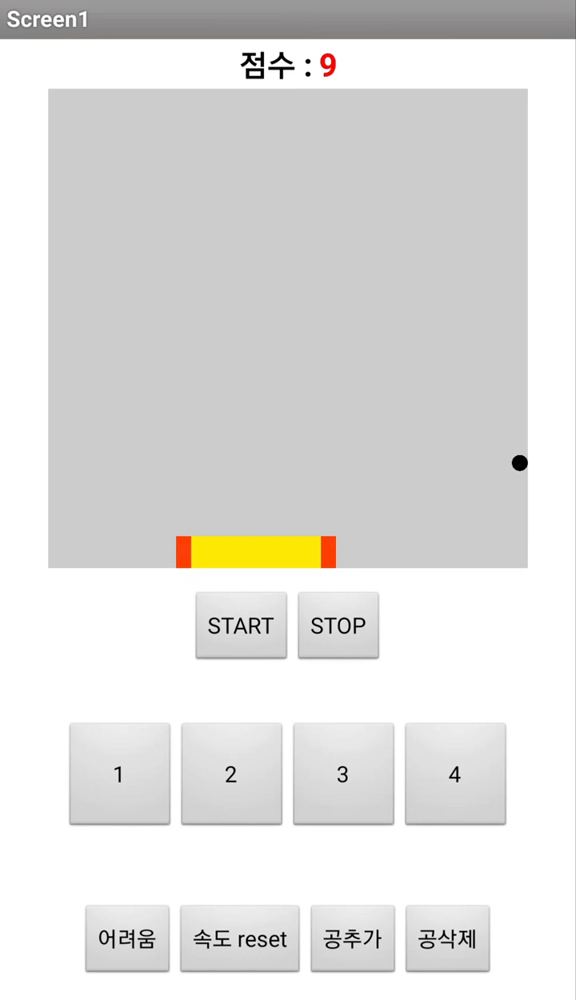
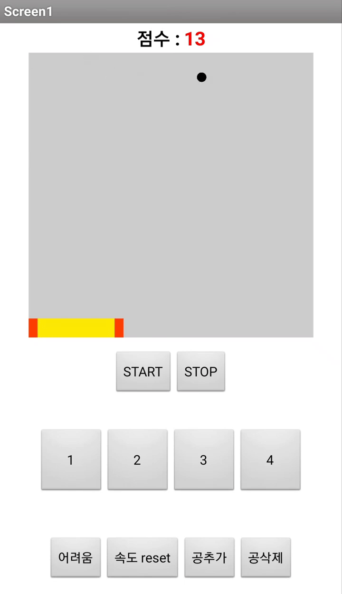
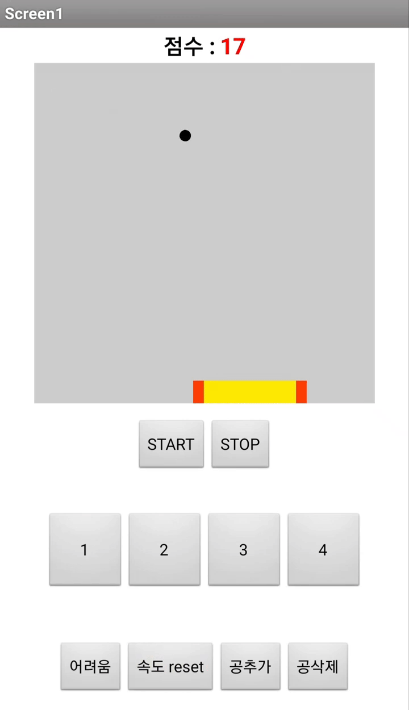

# 공 튀기기 게임 [개선.ver](MIT App Inventor 기반)

> 📆 제작일: 2021.09.04  
> 📎 원본 블로그: [똥선생의 ' 공 튀기기 게임 만들기 '](https://kujung.tistory.com/104)

---

## 🖼 프로젝트 비교

| 기존 게임 화면 (출처 블로그) | 개선된 내 게임 화면 |
|:-----------------------------:|:----------------------:|
|  |  |

---

## 🔧 프로젝트 설명

MIT App Inventor를 기반으로 만든 **공 튀기기 게임(BounceBall Game)** 으로,  
기존 게임의 조작 방식과 재미 요소를 개선하여 나만의 방식으로 업그레이드한 프로젝트입니다.

---

## 🚀 주요 기능 및 개선 사항

- 🎮 **조작 방식 개선**
  - 기존: 보드를 손가락으로 직접 드래그해야 함 → 조작감 불편
  - 개선: 버튼(1, 2, 3, 4)을 눌러 보드를 고정 위치로 이동시켜 더 정밀한 컨트롤 가능

- ⚙️ **기능 추가**
  - `어려움` 버튼: 공의 속도를 증가시켜 난이도 상승
  - `속도 reset` 버튼: 공의 속도를 기본값으로 초기화
  - `공 추가`: 공을 하나 더 생성해 최대 2개의 공으로 플레이 가능
  - `공 삭제`: 공이 2개일 경우, 하나를 제거해 다시 단일 공으로 변경

---

## 🧰 사용한 도구

| 툴/기술 | 설명 |
|--------|------|
| [MIT App Inventor](https://appinventor.mit.edu/) | 블록 기반 안드로이드 앱 개발 플랫폼 |
| 이미지 스프라이트, 캔버스 | 공 튀기기 게임에서 물리 효과 구현에 사용 |
| 블록 코딩 (이벤트, 조건, 수학 블록 등) | 공 이동, 충돌, 점수 계산, 버튼 기능 구현 |

---

## 🛠 앱인벤터 개발 화면

| 디자이너 화면 | 블록 코딩 화면 |
|:--------------:|:----------------:|
|  |  |

---

## 🎮 시연 장면 (GIF)

|  |  |  |
|:----------------------:|:----------------------:|:----------------------:|
|  |  |  |

> 플레이 장면을 6분할한 GIF로 확인할 수 있습니다.

---

## 🎥 YouTube 시연 영상

---

## 📎 관련 링크

- [MIT App Inventor 공식 사이트](https://appinventor.mit.edu/)
- [원본 참고 블로그](https://kujung.tistory.com/104)

---

> 본 프로젝트는 MIT App Inventor를 활용한 창작 및 기능 개선 실습 프로젝트입니다.  
> 블록 코딩을 통해 앱의 구조와 동작을 직접 설계하며 앱 개발에 대한 기초를 다질 수 있습니다.
